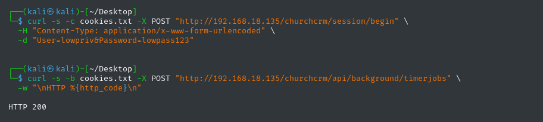

# Privilege Escalation via Timer Jobs Missing Admin Authorization

**Product:** ChurchCRM  
**Version:** 7.3.3 (earlier versions likely affected)  
**CVE:** Pending  
**CWE:** CWE-269 — Improper Privilege Management  
**Severity:** Medium  
**CVSS 4.0:** 5.3 — `CVSS:4.0/AV:N/AC:L/AT:N/PR:L/UI:N/VC:N/VI:L/VA:L/SC:L/SI:L/SA:N`  
**Discovered:** 2026-06-10  
**Author:** Caio Chagas  

---

## Description

The `POST /api/background/timerjobs` endpoint triggers all registered plugin cron hooks — including external backup operations — but is protected only by `AuthMiddleware`. Any logged-in user, regardless of role, can force immediate execution of administrative background tasks.

## Root Cause

In `api/routes/background.php`, the `/background` group is wrapped with `AuthMiddleware` only. The handler calls `SystemService::runTimerJobs()`, which fires `HookManager::doAction(Hooks::CRON_RUN)` — the same hook that scheduled cron calls use. The missing middleware is `AdminRoleAuthMiddleware`, which is applied to adjacent admin routes but was omitted here.

```php
// api/routes/background.php
$app->group('/background', function (RouteCollectorProxy $group): void {
    $group->post('/timerjobs', 'runTimerJobsAPI');
});
// ↑ No AdminRoleAuthMiddleware here
```

## Impact

- Any authenticated user can trigger all CRON_RUN plugin hooks on demand, bypassing the scheduled interval
- When the External Backup plugin is active and configured, this forces an immediate WebDAV backup — which also serves as an SSRF trigger (see VULN-05)
- Repeated calls can be used to exhaust server resources (disk I/O, database dumps, network transfers) without admin credentials

## Proof of Concept

```bash
# Step 1 — authenticate as any low-privilege user
curl -s -c cookies.txt -X POST "http://TARGET/churchcrm/session/begin" \
  -H "Content-Type: application/x-www-form-urlencoded" \
  -d "User=lowpriv&Password=lowpass123"

# Step 2 — trigger background jobs
curl -s -b cookies.txt -X POST "http://TARGET/churchcrm/api/background/timerjobs" \
  -w "\nHTTP %{http_code}\n"
```

**Expected response:**
```
HTTP 200
```

All registered cron hooks execute immediately under the web server's process.

## Evidence



## Affected Component

| Field | Value |
|-------|-------|
| Endpoint | `POST /api/background/timerjobs` |
| File | `api/routes/background.php` |
| Function | `runTimerJobsAPI`, `SystemService::runTimerJobs` |
| Auth required | Yes — any authenticated user (should be admin only) |

## Timeline

| Date | Event |
|------|-------|
| 2026-06-10 | Vulnerability discovered and confirmed |
| 2026-06-10 | Vendor notified via GitHub Security Advisories |
| TBD | CVE ID assigned |
| TBD | Patch released |
| TBD | Public disclosure |

## Remediation

Add `->add(AdminRoleAuthMiddleware::class)` to the `/background` route group in `api/routes/background.php`. One line change.

## References

- [ChurchCRM source](https://github.com/ChurchCRM/CRM)
- [Affected file](https://github.com/ChurchCRM/CRM/blob/master/api/routes/background.php)
